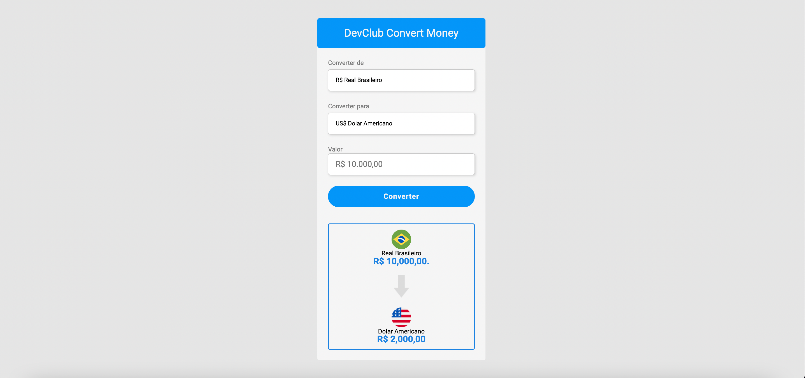

# Money Converter

 
 
 # Sobre o projeto
 
 Esse projeto tem um intuito de colocar em pratica os conhecimentos de javaScript, HTML e CSS. Nesse projeto também é feito consumo de API, onde os valores das contações são atualizadas de acordo com a variação para uma melhor precisão na hora da conversão. Esse projeto foi de muito aprendizado, nele é possivel converter para euro, dolar e bitcoin.
 
 # Desafios
 
 Esse projeto foi desafiador na questão de funções de JavaScript mas, no final deu pra concretizar bastante coisa sobre funções, funções assicronas, consumo de API e também de desenvolvimento web com HTML e CSS

# Tecnologias 

 
